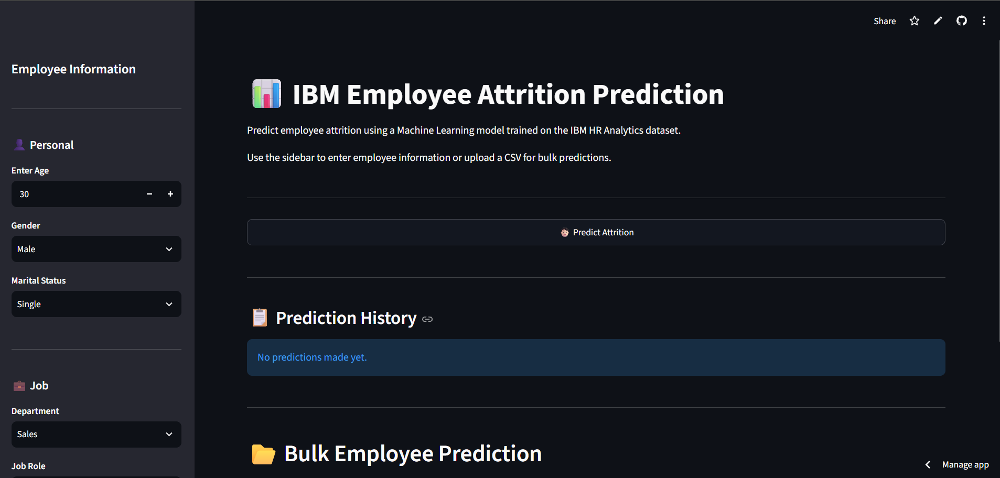
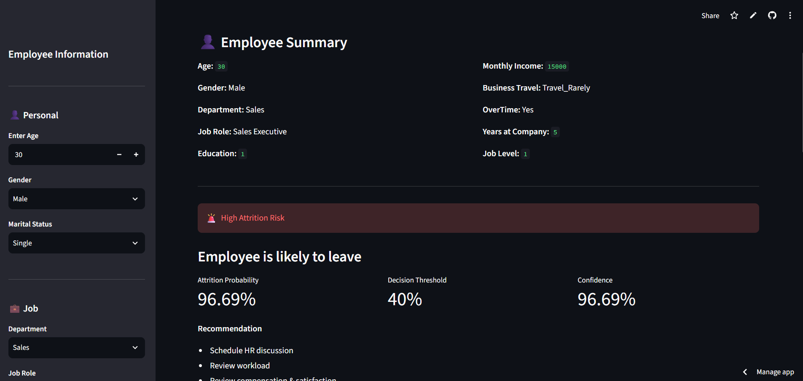
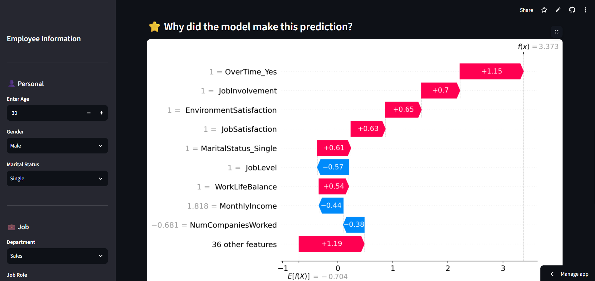
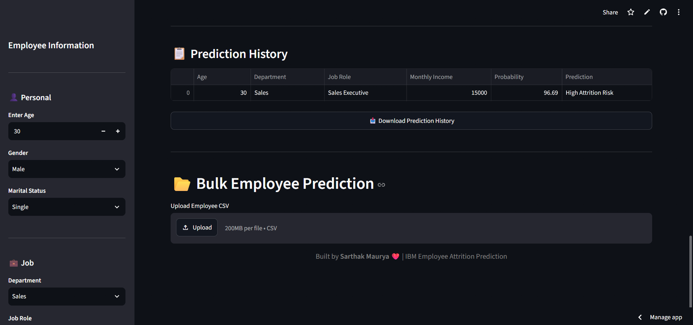
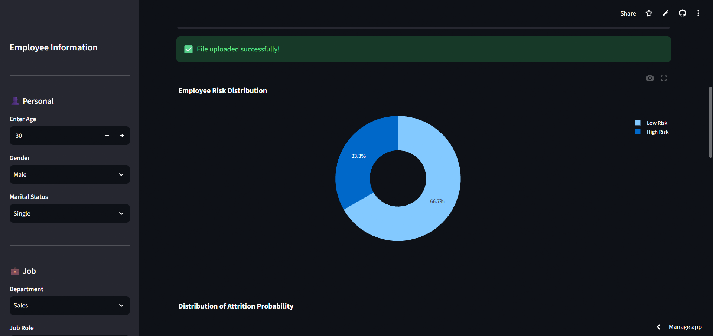
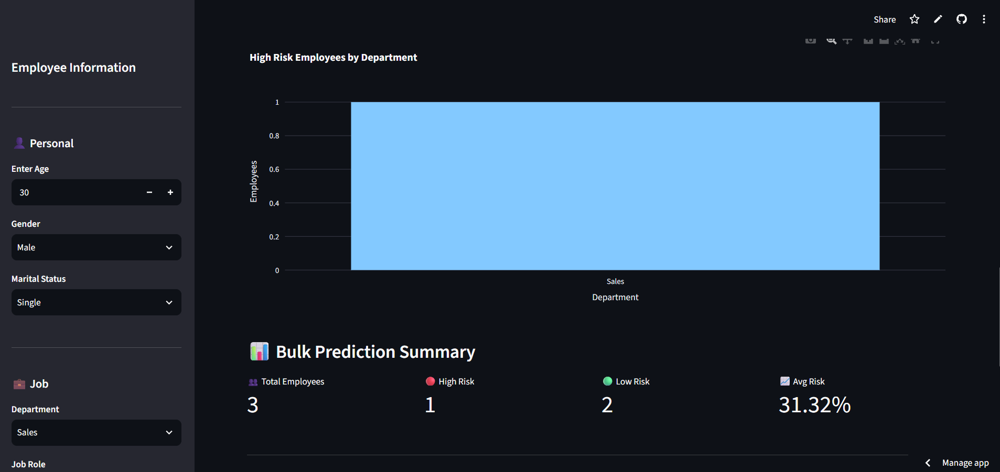
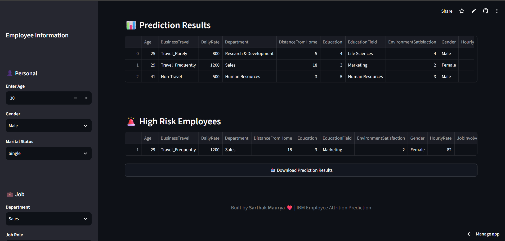

# 📊 IBM Employee Attrition Prediction

An end-to-end Machine Learning web application that predicts whether an employee is likely to leave the company based on HR-related features.

The application is built using **Logistic Regression**, provides **SHAP explainability**, supports **single and bulk predictions**, and is deployed using **Streamlit Cloud**.

---

## 🚀 Live Demo

🔗 **Live App:** https://ibm-employee-attrition-prediction-zlrvnosm28ymgbgjjkmzcb.streamlit.app/

🔗 **GitHub Repository:** https://github.com/Arceaus/IBM-Employee-Attrition-Prediction

---

## 📸 Application Preview

### 🏠 Home Page



---

### 🔮 Single Employee Prediction



---

### 🧠 SHAP Explainability



---

### 📜 Prediction History



---

### 📊 Bulk Prediction Dashboard



---

### 📈 Bulk Prediction Summary



---

### 🚨 High Risk Employees



---

## ✨ Features

- 🔮 Predict employee attrition for a single employee
- 📁 Bulk prediction using CSV upload
- 🧠 SHAP Explainability (Waterfall Plot)
- 📊 Attrition Probability Score
- ⚠️ High Risk Employee Identification
- 📈 Prediction History
- 📥 Download Prediction History
- 🌐 Fully deployed using Streamlit Cloud

---

## 🛠 Tech Stack

- Python
- Streamlit
- Scikit-learn
- Pandas
- NumPy
- SHAP
- Plotly
- Matplotlib
- Joblib

---

## 📂 Project Structure

```text
IBM-Employee-Attrition-Prediction/
│
├── app.py
├── config.py
├── requirements.txt
├── README.md
│
├── models/
│   ├── lr_class_weight.pkl
│   ├── preprocessor.pkl
│   └── background_data.pkl
│
├── data/
│   └── IBM HR Analytics Employee Attrition.csv
│
├── notebooks/
│   └── project_alpha.ipynb
```

---

## 📊 Dataset

**Dataset:** IBM HR Analytics Employee Attrition Dataset

The dataset contains employee-related information such as:

- Age
- Department
- Job Role
- Monthly Income
- Job Satisfaction
- OverTime
- Work-Life Balance
- Distance From Home
- Years at Company
- and many more HR features.

---

## 🤖 Machine Learning Model

**Algorithm Used**

- Logistic Regression (Class Weight Balanced)

The model predicts:

- High Attrition Risk
- Low Attrition Risk

Decision Threshold:

```text
0.40
```

---

## 🧠 Explainable AI

This project uses **SHAP (SHapley Additive exPlanations)** to explain every prediction.

The waterfall chart shows:

- Features increasing attrition risk
- Features decreasing attrition risk
- Individual contribution of each feature

---

## ⚙ Installation

Clone the repository

```bash
git clone <your-repository-url>
```

Install dependencies

```bash
pip install -r requirements.txt
```

Run the application

```bash
streamlit run app.py
```

---

## 📈 Future Improvements

- User Authentication
- PDF Report Generation
- Email Notifications
- Model Comparison Dashboard
- Advanced Explainability
- Docker Deployment

---

## 👨‍💻 Author

**Sarthak Maurya**

Aspiring Data Scientist

GitHub: https://github.com/Arceaus

LinkedIn: https://www.linkedin.com/in/sarthak-maurya-59b82a366/